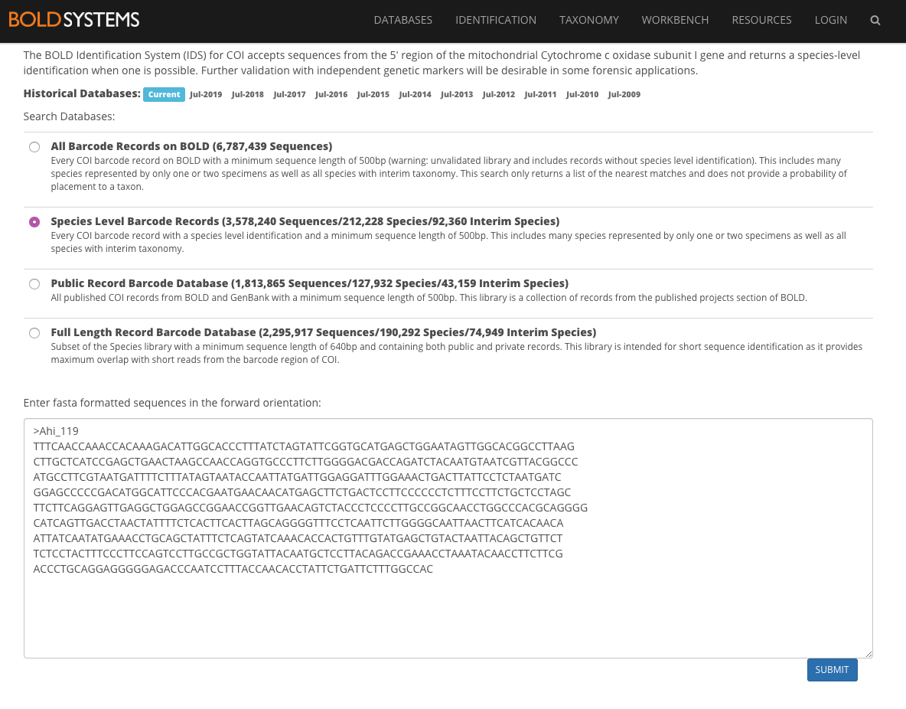
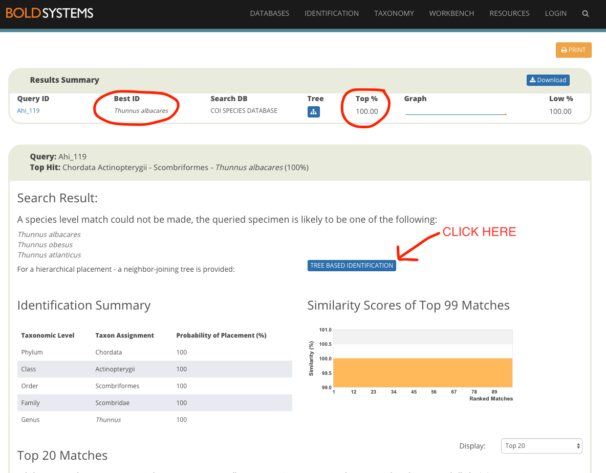
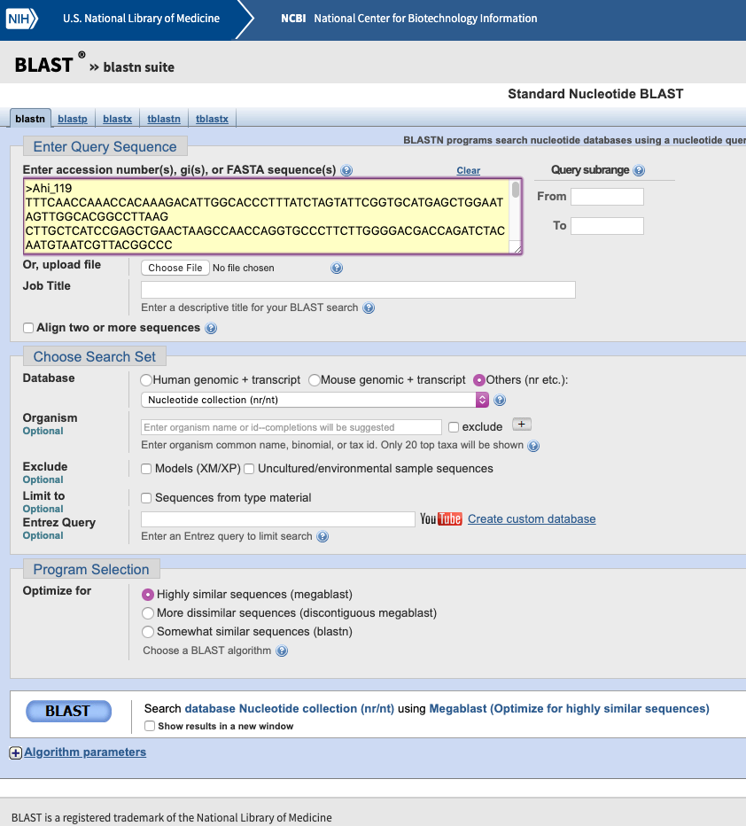

EVE 109 Section Week 7
================

### 1. Barplots

Today we'll learn to make barplots. Let's use the `Arthritis` dataset from the `vcd` package:

``` r
library(vcd)
```

    ## Loading required package: grid

``` r
data(Arthritis)
head(Arthritis)
```

    ##   ID Treatment  Sex Age Improved
    ## 1 57   Treated Male  27     Some
    ## 2 46   Treated Male  29     None
    ## 3 77   Treated Male  30     None
    ## 4 17   Treated Male  32   Marked
    ## 5 36   Treated Male  46   Marked
    ## 6 23   Treated Male  58   Marked

 

Previously, we learned how to use the `table` command to summarize columns in a dataframe. For example, maybe we want to know what the various outcomes were for treated patients. We first subset the data based on treatment, then we can count the number of patients with each outcome.

``` r
treated <- subset(Arthritis,Treatment=="Treated")
table <- table(treated$Improved)
table
```

    ## 
    ##   None   Some Marked 
    ##     13      7     21

 

What if we want to depict this graphically? We can use a barplot, which work for count data. All you have to do is provide a table as the input:

``` r
barplot(table)
```


     

### 2. Our data!! Fasta format.

Our data is back! Here is a quick run down of what happened to your fish samples after you gave them to me (these are good details for your project report!):

1.  DNA was extracted using a CTAB protocol
2.  We used PCR to amplify the mitochondrial COI region using primers designed for fish
3.  PCR products were sent for Sanger sequencing at the UC Davis DNA technologies core
4.  Forward and reverse sequences were collapsed, sequences were checked for quality, and low quality regions were trimmed

We had a total of 17 samples. So far, we have not been able to obtain DNA from two of them (we're still trying though!). The remaining 15 sequences are in the file "Ahi\_sequences.fasta". Open that file in a text editor and see how it looks.

    ## >Ahi_119
    ## TTTCAACCAAACCACAAAGACATTGGCACCCTTTATCTAGTATTCGGTGCATGAGCTGGAATAGTTGGCACGGCCTTAAG
    ## CTTGCTCATCCGAGCTGAACTAAGCCAACCAGGTGCCCTTCTTGGGGACGACCAGATCTACAATGTAATCGTTACGGCCC
    ## ATGCCTTCGTAATGATTTTCTTTATAGTAATACCAATTATGATTGGAGGATTTGGAAACTGACTTATTCCTCTAATGATC
    ## GGAGCCCCCGACATGGCATTCCCACGAATGAACAACATGAGCTTCTGACTCCTTCCCCCCTCTTTCCTTCTGCTCCTAGC
    ## TTCTTCAGGAGTTGAGGCTGGAGCCGGAACCGGTTGAACAGTCTACCCTCCCCTTGCCGGCAACCTGGCCCACGCAGGGG
    ## CATCAGTTGACCTAACTATTTTCTCACTTCACTTAGCAGGGGTTTCCTCAATTCTTGGGGCAATTAACTTCATCACAACA
    ## ATTATCAATATGAAACCTGCAGCTATTTCTCAGTATCAAACACCACTGTTTGTATGAGCTGTACTAATTACAGCTGTTCT
    ## TCTCCTACTTTCCCTTCCAGTCCTTGCCGCTGGTATTACAATGCTCCTTACAGACCGAAACCTAAATACAACCTTCTTCG
    ## ACCCTGCAGGAGGGGGAGACCCAATCCTTTACCAACACCTATTCTGATTCTTTGGCCAC

This is called **fasta** format. In this format each line starts with the "&gt;" character and everything after that provides information about the sample. In our case, the relevant information is the sample ID. This is the number that was on the top of the tube when you did your collecting.

     

### 3. Our metadata

Our metadata is in a file called "Ahi\_metadata.csv". Open this in a spreadsheet editor like Excel. Notice that the names in the "ID" column match the sample identifiers in the fasta file.

     

### 4. Species ID from COI - the BOLD Database

We will use two different databased to determine species ID. The first is the [Barcode of Life Database (BOLD)](https://www.boldsystems.org/index.php/IDS_OpenIdEngine). On the **Identification** tab, click on the **Species Level Barcode Records**. Then go to your fasta file, highlight the first sequence, and copy and paste it into the browser and click **Submit**.



 

We'll focus on the **Results Summary** box. This gives the species ID for the most similar sequence in the database as well as the % similarity:



 

**We'll want to record this information on our spreadsheet. In Excel, make two new columns labelled "BOLD.species" and "BOLD.similarity". Then we can start to fill in this information. So for example, for Ahi\_119 we would input "Thunnus albacares" into the BOLD.species column and "100" into the BOLD.similarity column.**

 

Take a look at the rest of the page. Notice that the algorithm isn't 100% sure about the species ID, but we can look at the results a little bit more so understand how certain we might be. Click on *Tree Based Identification*. You'll get a box telling you that the functionality is disabled, just click ok and keep going. Click through the different reports (especially "PDF tree" and "Taxonomy Report") and try to understand how confident we are in our species ID.

**Now make an extra column in your Excel spreadsheet called "BOLD.mislabelled". For each sample, record "YES" or "NO" based on your top hit. Fill out the three new columns for each record for which we have sequence data**

     

### 5. Species ID from COI - the BLAST

Another database we can use is [NCBI](https://blast.ncbi.nlm.nih.gov/Blast.cgi?PROGRAM=blastn&PAGE_TYPE=BlastSearch&LINK_LOC=blasthome). The NCBI database is much less curated, but also bigger. We will use the BLAST tool to search for sequences similar to our own. Copy and paste the first sequence into the BLAST tool and click **BLAST**.



 

You will see a list labelled **Sequences producing significant alignments**. These are listed with the most similar sequence first. This gives you information on the species as well as different measures of similarity:


 

**Make three new columns in your spreadsheet called "BLAST.species", "BLAST.similarity", and "BLAST.mislabelled". Fill these in for all the samples we have sequenced. Save your updated spreadsheet.**

     

Homework
========

Now that we've generated some data, we can start to summarize it.

### *Homework 7: Write a script that does the following:*

#### 1. Finish filling out the spreadsheet with results from BOLD and BLAST. Read the data file into R and print the dataframe.

#### 2. Make a barplot showing the number of samples labelled correctly vs. incorrectly according to BOLD.

#### 3. Make a barplot showing the number of each species we found based on BOLD.
